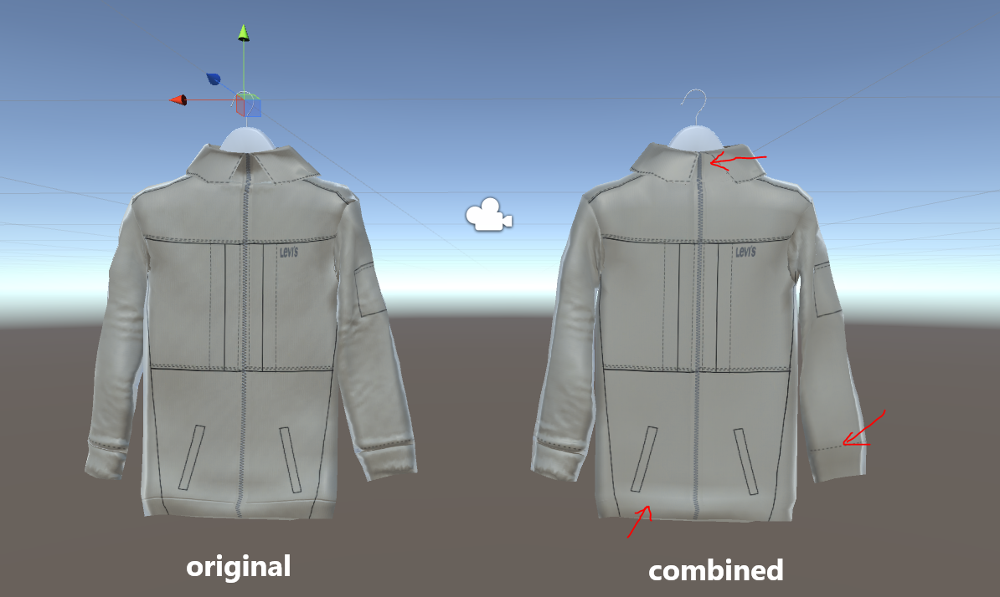

# IWD Senior 3D developer challenge

## Setup

Unity3D and a C#

## Guidelines

We would like to see how you tackle a bug. This involves understanding existing code, as well as having advanced knowledge in Unity's PBR. 

## Content

In the exercice you will find an existing Unity project (it is made with Unity 5, but it should work in any recent version)
There are very few scripts:  
 - MeshCombiner: takes a Transform, finds all mesh filters in all its children, and combines their meshes in a single new mesh. 
 - CombineMeshes: a Monobehaviour allowing you to assing a game object and execute the above script on it  
 
As you will see, after the new mesh is created, the normal map which applied perfectly to the original mesh, has some artefacts (pointed by red arrows):  

How to test: 
 - Open TestScene.unity 
 - Check the CombineMeshes gameobject - it already has a Transform assigned 
 - Enable the CombineMeshes script and observe the result  
 
The bug is somewhere in the MeshCombiner.CombineMeshes() method, and some logical thinking and knowledge might help you narrow down the possibilities. 
The code is from an older version of a tool that we use. It is a perfect example of code that you may encounter with us: written by someone else, potentially outdated, potentially different from your own coding standards, but still in need of fixing.
Note: Unity now has an integrated method to combine meshes, but the goal of the exercice is to fix the provided "manual" method.   
