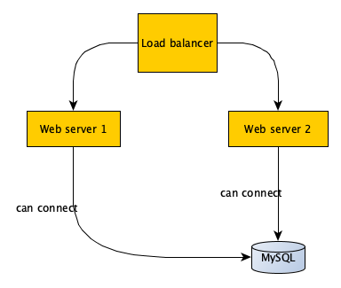

# IWD OPS challenge

## Guidelines

We want to see your skills to design efficient and maintainable infrastructure over time.

You can choose between two challenges described below: 

- Ansible & scripting
- Terraform 

You can also do both if you feel like it, but no obligation at all. 

## DO

- Do make your design maintainable. Think of those exercices as the beginning of a larger project destined to evolve over time.
- Do comment your code ! It will make our review easier
- Do add some side notes as comment if needed, especially to explain if for any reason you do not comply with some of the constraints.
  We will assess your adaptation skills. Explain why you cannot or won’t do some things.

## DON'T

- Do not lose time with optimization
- Do not reinvent the wheel, you are welcome to use any existing module

## Test 1: ansible & scripting

The purpose of this test is to deploy a Wordpress site. This software has been chosen since its install is simple. The application must work after the process (no install steps to do manually).

The application will go on a virtual machine and the database on another virtual machine.

Everything must be **automated**. Ideally, in just one script you will:
* Create the VMs
* Provision them (webserver, database...) - with Ansible
* Deploy Wordpress - with Ansible
* Install Wordpress - with Ansible

Software:
* VirtualBox for the VMs (or any other Virtualization software you are comfortable with)
* Distribution: Debian/Ubuntu (alternatively you can use Redhat-based distrib)
* Webserver: Apache or Nginx
* Database: MySQL

## Test 2: AWS management with Terraform

The purpose of this test is to code the infrastructure of a simple web application running on AWS.
This application is composed of:

- 2 ec2 instances acting as webservers
- a load balancer pointing on them (does not need to handle https)
- an RDS MySQL database

# Constraints

- Only use instances available in AWS free tier
- Use a linux distribution of your choice
- Web servers should serve a web page, which can be the stock distribution page. It should be visible when hitting the loadbalancer
- Web servers should be able to connect to the database server, but there is no no need to setup a real database.
- Securize the application as you see fit.