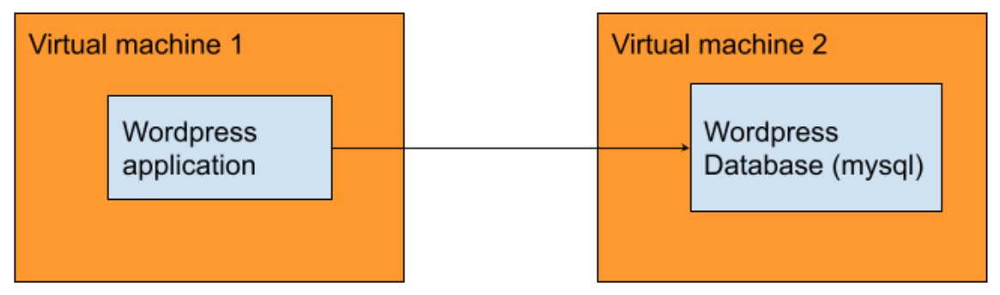

# IWD OPS challenge

## Guidelines

We want to see your skills to design **efficient** and **maintainable** infrastructure over time. This exercise might seem simple and some shortcuts can be used, but think it as the **beginning of a larger project** destined to **evolve in time**.

DO

- Do use good design
- Do maintainable design
- Do comment your code ! It will be easy for our review
- Do documentation if it needed, especialy to explain If, for any reason, you do not comply with some of the constraints. We will assess your adaptation skills. Explain why you cannot or won’t do some things.

DON'T DO

- Do not loose time with optimization
- Do not reinvent the wheel, you are welcome to use any existing module

## The Test

The purpose of this test is to deploy a Wordpress site. This software has been chosen since its install is simple. The application must work after the process (no install steps to do manually).

The application will go on a virtual machine and the database on another virtual machine.

Everything must be **automated**. Ideally, in just one script you will:
* Create the VMs
* Provision them (webserver, database...) - with Ansible
* Deploy Wordpress - with Ansible
* Install Wordpress - with Ansible

Software:
* VirtualBox for the VMs (or any other Virtualization software you are comfortable with)
* Distribution: Debian/Ubuntu (alternatively you can use Redhat-based distrib)
* Webserver: Apache or Nginx
* Database: MySQL