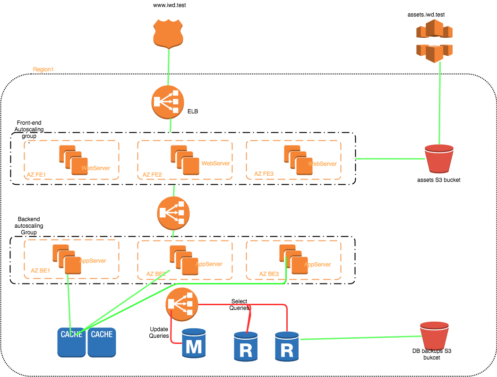

# Proposal

Write here you proposal of the [asked architecture](README.md).
## Bare metal platform VS Cloud platform
I privilege cloud platform to bare metal ones, for the uniq reason that hardware is managed by the cloud provider and it represents  a non negligeable cost, in addition to hardware evelution and upgrade.
With cloud provider, i'm sure to use last generation of the hardware.

In my proposal, i'm basing my solution on **AWS cloud** and all my design will use the resources that **AWS** provides us.

## Elements to take in consideration
### Plan of Activity Continuity
- scalability to overtake the eventual load that the app will face.
- Reduce SPOFS or eliminate them
### Plan Activity Recovery
 - Backups
 - Disatser recovery
 ### Platform provisioning and deployements pipelines
 - Need to be provision my platform (PaaC)
 
 ## How i see this architecture
 We are here in a multitier application
 - Static HTML front
 - A PHP Backend
 - and a Mysql database
 
 Each part of our application represents a SPOF, our application will not work if one these three parts is unavailable.
 
 ### Front-end
 As our front is a static HTML, so a CDN is the best solution for us, because this will improve the user experience as the contents will be downloaded (viewed) quickly by our users (visitors).
 And CDN allows as the hace our front available in different geographical regions without needing to purchase any hardward.
 If we should AWS, CloudFront is our solution. It manages the cache and versions of the app efficiently.
 
 ### Back-end
 There are many solutions to design a solution for our back, one of them is to use 
 1. an **E**lastic **L**oad **B**alance (**ELB**) in front of my backend servers. This ELB will be available in one region and all availability zones.
 This will guarantee that my ELB still always available (The only worst case is when a region is down ??? **SPOF**)
 We can improve this by using another ELB in an other region and creating a **route53** DNS entry (**CNAME**) that points to my two ELBs.
 2. Attached to each ELB, three **E**lactic **C**loud **C**ompute (**EC2**) instances, each one in an availibilty zone.As AWS has three availability zone on each Region. this guarantee the availability of the service on that region.
 3. Implement the scalibilty of the Backend:
    - On each region, i'll create lauch configuration and an autoscaling group that will absorb the overload that my app will eventually face.
    - Conditions of upscaling or downlscaling will be defined according to the banchmark that will be done on backend (how many requests it can handle per minutes without crashing the resources. TO BE DEFINED)
    - Once the values will be known, we will create cloud watch events on the our ELBs that will scale our backend service.
    - for the downlscale, we will use CloudWatch Events to do that, if we observe number of request above a threshould, we will downscale our capicity.
    
 ### Database
 For the database service, I will use the service **R**elational **D**atabase **S**ervice (**RDS**), It's managed by AWS with the ability to taylor some parameters on mysql Server (**Parameter groups**). 
 The cons, there is no ssh access to the server, only sql access. we can't realy see system logs and other perfs related to the system. Sometime AWS schedules maintenance on the servers which, sometime, makes the resources unvailable for few minutes, so should have an architecture that is taking account about this. 
 This service manages efficiently automatic backups as snapshots which are easly restored as RDS instances. in addition the these snapshots, we will save them on S3 buckets.
 
 For the database resource, i'll use mysql Aurora RDS cluster. This will garantee that my data will be always available for my users (visitors). storage scalability, high availablility (multiple availibility zones).
 
 I think that we convered all SPOFs that our app can have.
 
 ## Tooling
 ### Code
 I will host my code on github repositories. I'll have 2 or three repositories for my app: Front, Backend The schema of database or scripts to create my database, this last also can be managed in backend repository (here i think espacially for rails apps).
 To manage my platform as a code, i need also to have another reporsitory for my platform.
 ### Tools
 - For my platform, i'll use terraform. It really a powerfull and rich tool to manage cloud infrastruture or other resources as a code. It is open source and the community is active and many providers are managed now by terraform.
 Why wouldn't use CloudFormation, For the simple resaon if i need someday to manage a part of my app on another cloud or just host it in my office, Terraform will be more felxible to my new situation thant cloudformation which only work with AWS resources.
 - For my code, as i'm decided to use Github, so my developpers will use git.
 - Moniroting, Metrologie: In addition to cloudwatch, i'll put in place an ELK stack in order to collect app logs to extract metrics and plot them as graphs. Also Kibana is able to create diagrams, this will usefull to understand the behaviour of our app.
 - Deployment pipeline: CI/CD pipelines will be set. The CI pipeline, will be ensured by Travis CI for each **P**ull. Travis CI is already integrated to GitHub. **R**equest (**PR**). No PR mergeable if no at least two reviewers validated the code. The CD pipeline, can managed by jenkins, which will fire an instance on which we will have ansible or any orchestration tool to deploy code on our servers (Front-end and/or Backend). _Don't have skill to develop these section, Need to learn and improve them._
 - For Dev team, a process will be imposed even we are agility. Each change should be reviewed by at least two collaborators,  the code average of the code should be around 95%, the **P**roduct **O**wener has the decision to deploy in production or not by validating the features.
 - The deployement will be done with Ansible, it's powerfull and agentless. This project has grown quickly and and no need to install any additionnal software to use it (it's based on python). The articles i find on the web don't recommand ansible for large infrastructures, i didn't try it to confirm or not, all my env are medium ones. 
 Ansible uses yml to describe the task that will be performed. It's easy to learn.
 
 
 ## Disater Recovery
 In the worst case, we will loose all our infrastructure no front-end, no back-end and no database.
 The infra will be (re)created  with terraform (we can can create our DB from a snapshot with terraform)
 With ansible we will deploy our code on each tier of our app (front-end and backend)
 
 
 ## Network and security
this will be detailled on the schema (to be completed).
 
 ## Improvements
 ### Add a caching server 
 we can use the service Elasticache of AWS. We can integrate it easily with our architecture, the service is managed by AWS, so this will save us a time to work on other features.  The cons i can see, is the unavailibity of the server in case of an overhead.
 
## Architecture Design in the main Region
 
 

 
 
 
 
 
